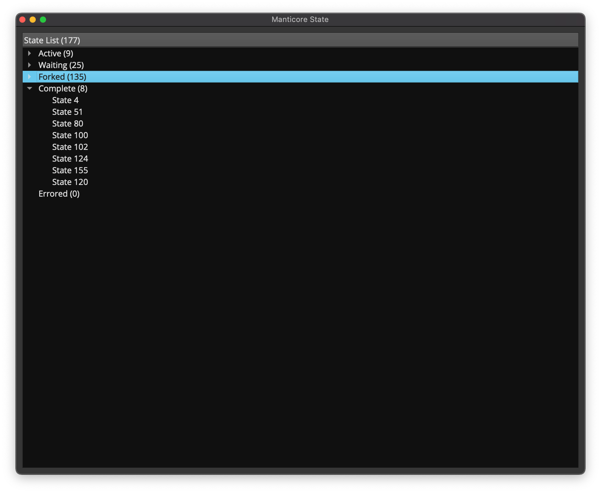
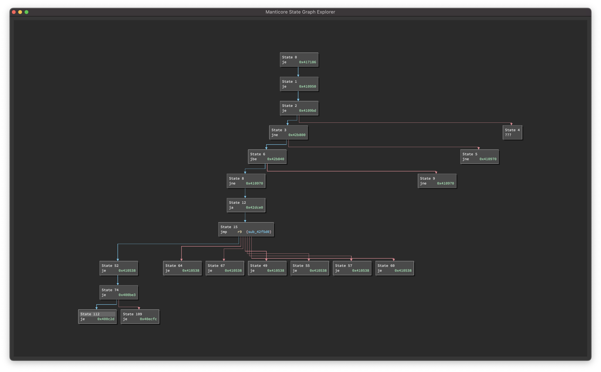
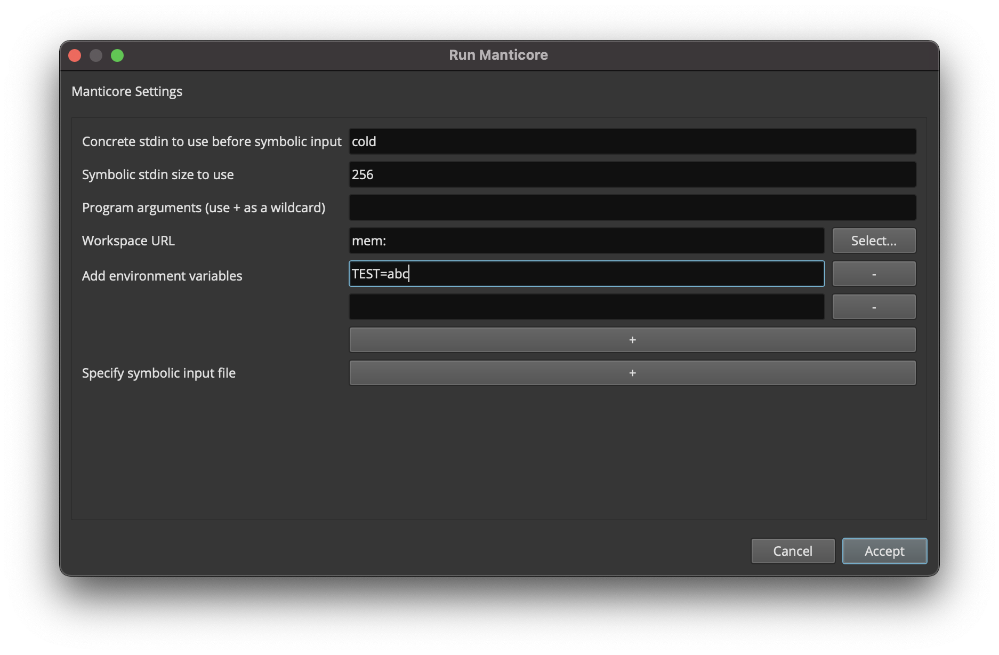
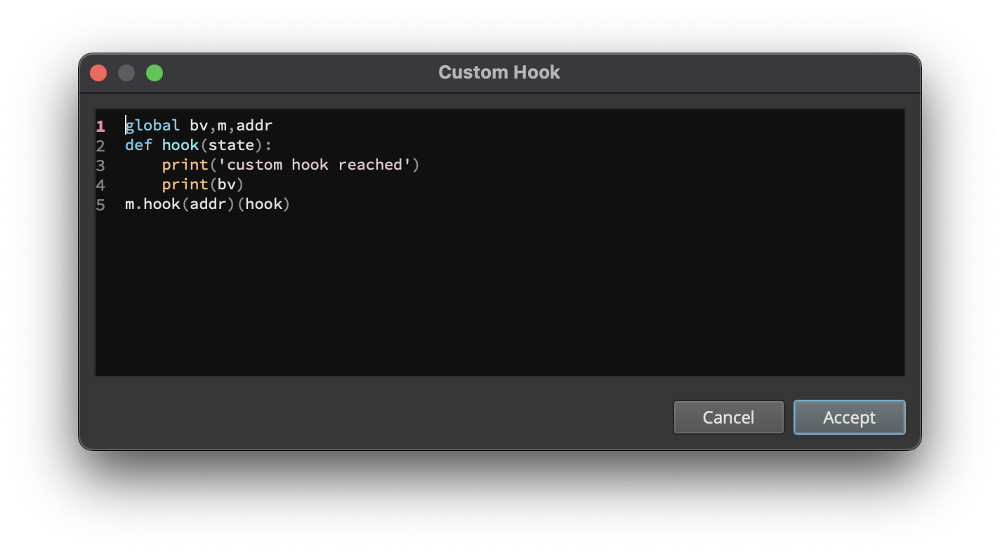
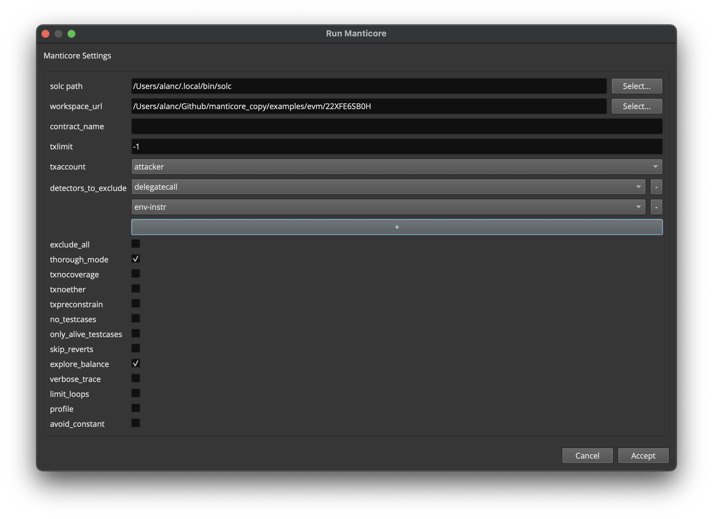
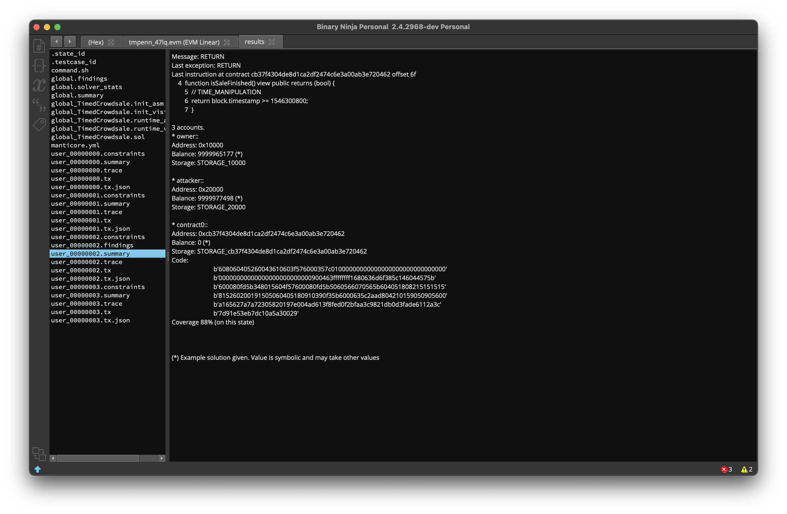

===
MUI
===

.. image:: https://raw.githubusercontent.com/trailofbits/manticore/master/docs/images/manticore.png
    :width: 200px
    :align: center
    :alt: Manticore

With the Manticore User Interface (MUI) project, we provide a graphical user interface plugin for `Binary Ninja <https://binary.ninja/>`_ to allow users to easily interact with and view progress of the `Manticore symbolic execution engine <https://github.com/trailofbits/manticore>`_ for analysis of smart contracts and native binaries.

❗ATTENTION❗ This project is under active development and may be unstable or unusable. Please open an issue if you have any difficulties using the existing features. New feature development will be considered on a case by case basis.

Requirements
------------

Aside from the Python requirements, we require the following:

* Binary Ninja (latest development version) with GUI
* ``git submodule update --init --recursive`` for Manticore submodule

Installation
------------

MUI requires a copy of Binary Ninja with a GUI. Currently we are testing against the latest ``dev`` release(s) (``2.4.2901-dev`` at time of writing).

Manticore only operates on native binaries within a Linux environment. EVM support has only been tested on Mac and Linux, and it requires the installation of `ethersplay <https://github.com/crytic/ethersplay>`_.

Python dependencies are currently managed using ``binjastub/requirements.txt`` and ``requirements-dev.txt``. You can run ``make init`` to set up a development environment.

#. Make the project available to Binary Ninja by creating a symbolic link to the plugins directory. From within the root of this repo, run the following::

    # For Mac
    $ ln -s "$(pwd)/mui" "${HOME}/Library/Application Support/Binary Ninja/plugins/mui"

    # For Linux
    $ ln -s "$(pwd)/mui" "${HOME}/.binaryninja/plugins/mui"

#. Make sure Binary Ninja knows about our Python virtual environment.

   #. Open Binary Ninja's "Preferences" -> "Settings" -> "Python" and ensure the "Python Interpreter" is correctly set to the Python path associated with the current virtual environment. Reference ``venv/pyvenv.cfg`` to find the base path.

   #. Copy and paste the absolute path of the MUI project into Binary Ninja's "Python Virtual Environment Site-Packages" and add the required ``/venv/lib/python3.<minor_version>/site-packages`` suffix for the site-packages path.

   #. Restart Binary Ninja if necessary.

Development
-----------

Installing currently listed dependencies::

    $ make init
    # For Mac (will be similar for Linux)
    $ export PYTHONPATH="/Applications/Binary Ninja.app/Contents/Resources/python:/Applications/Binary Ninja.app/Contents/Resources/python3"

Activating the python virtual environment (do this before running other make commands)::

    $ . venv/bin/activate

Code style and linting can be followed by running the following::

    $ make format
    $ make lint

Tests for code without Binary Ninja interaction can be run if you have a headless version of binary ninja available, otherwise only non-Binary Ninja tests will be run::

    $ make test

Adding a new dependency can be done by editing ``binjastub/requirements.txt`` or ``requirements-dev.txt`` and then running the following in the virtual environment::

    $ pip install -r requirements-dev.txt -r binjastub/requirements.txt

Usage (Native)
--------------

All MUI features can be accessed through either the right-click context menu or the command palette. Common features include:

- Find Path to This Instruction / Remove Instruction from Find List
- Avoid This Instruction / Remove Instruction from Avoid List
- Add/Edit Custom Hook
- Solve With Manticore / Stop Manticore

And the following widgets are available:

- State List Widget

    Shows all the Active/Waiting/Complete/Errored states during manticore execution.
    Double-clicking a certain state navigates you to the current instruction of that state and renders its provenance tree in the graph widget.

- State Graph Widget

    Shows the provenance tree for a certain state selected in the list widget. ``Tab`` can be used to expand/collapse the graph and double-clicking any of the state nodes navigates you to the current instruction of that state.

- Run Dialog

    The run dialog is shown when you invoke the ``Solve with Manticore`` command. It allows you to configure the various manticore options, and the changes will be saved to the ``bndb`` file. Some example configs include using a combination of ``LD_PRELOAD`` and ``LD_LIBRARY_PATH`` environment variables to run the binary with custom glibc.

- Custom Hook Dialog

    The custom hook dialog can be accessed using the ``Add/Edit Custom Hook`` command. It allows you to define a custom manticore hook at the selected address. You also have full access to the Binary Ninja API which allows you to add highlighting, comments, and more. A defined hook can be removed by setting the code input field to blank.

Usage (EVM)
--------------

EVM support is currently a bit limited. MUI EVM only supports the same feature set as the `Manticore CLI tool <https://github.com/trailofbits/manticore>`_. Available commands include:

- Load Ethereum Contract
- Solve With Manticore / Stop Manticore

And the following views are implemented:

- EVM Run Dialog

    The run dialog is shown when you invoke the ``Solve with Manticore`` command. It allows you to configure the various manticore options, and the changes will be saved to the ``bndb`` file.

- Run Report

    The report page shows the result of a manticore execution. It displays all the files produced using the Binary Ninja UI.

