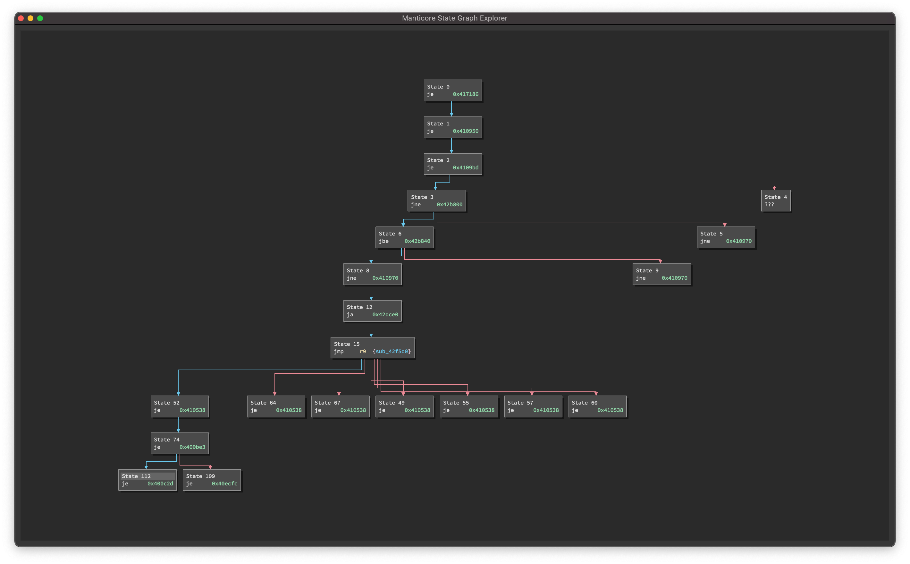
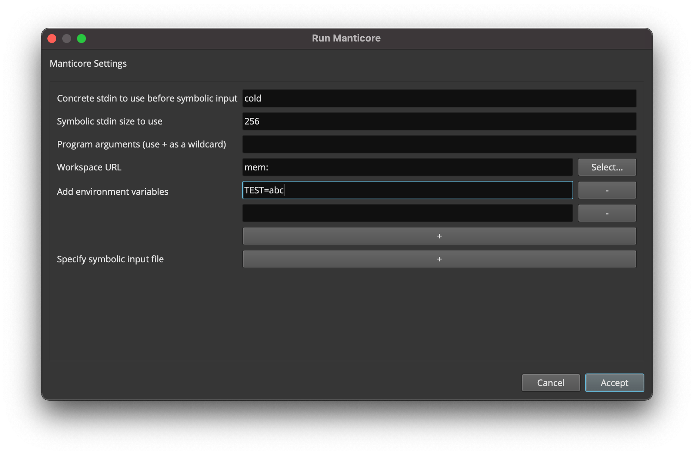

================================
Manticore UI Binary Ninja Plugin
================================

.. image:: https://raw.githubusercontent.com/trailofbits/manticore/master/docs/images/manticore.png
    :width: 200px
    :align: center
    :alt: Manticore

This directory provides a graphical user interface plugin for `Binary Ninja <https://binary.ninja/>`_ to allow users to easily interact with and view progress of the `Manticore symbolic execution engine <https://github.com/trailofbits/manticore>`_ for analysis of smart contracts and native binaries.

❗ATTENTION❗ This project is experimental and may be unstable or unusable for arbitrary use-cases and targets. Please `open an issue <https://github.com/trailofbits/ManticoreUI/issues/new/choose>`_ if you have any difficulties using the existing features. We will consider new feature suggestions on a case-by-case basis. If possible, please open a pull request to improve or fix the project.

Requirements
------------

Aside from the `Python requirements <binjastub/requirements.txt>`_, we require the following:

* Binary Ninja (latest version) with GUI
* `just <https://github.com/casey/just>`_

Installation
------------

MUI requires a copy of Binary Ninja with a GUI. We are currently developing against the latest stable release (``3.1.3469`` at time of writing).

Manticore only operates on native binaries within a Linux environment. EVM support has only been tested on Mac and Linux, and it requires the installation of `ethersplay <https://github.com/crytic/ethersplay>`_.

Python dependencies are currently managed using ``binjastub/requirements.txt`` and ``requirements-dev.txt``. Run::

    $ just init

to set up the necessary Python environment. You can check what commands are executed by looking at the `justfile <justfile>`_.

#. Make the project available to Binary Ninja by creating a symbolic link to the plugins directory. From within the root of this repo, run the following::

    # For Mac
    $ ln -s "$(pwd)/mui" "${HOME}/Library/Application Support/Binary Ninja/plugins/mui"

    # For Linux
    $ ln -s "$(pwd)/mui" "${HOME}/.binaryninja/plugins/mui"

#. Make sure Binary Ninja knows about our Python virtual environment.

   #. Open Binary Ninja's preferences ("Edit" -> "Preferences" -> "Settings" -> "Python") and ensure the "Python Interpreter" is correctly set to the same version as your virtual environment.

   #. Copy and paste the absolute path of the MUI project (``pwd``) into Binary Ninja's "Python Virtual Environment Site-Packages" and add the required ``/venv/lib/python3.<minor_version>/site-packages`` suffix for the site-packages path.

   #. Restart Binary Ninja if necessary.

Usage (Native)
--------------

All MUI features can be accessed through either the right-click context menu or the command palette. Common features include:

- Find Path to This Instruction / Remove Instruction from Find List
- Avoid This Instruction / Remove Instruction from Avoid List
- Add/Edit Custom Hook
- Add/Edit Global Hook
- Add Function Model
- Solve With Manticore / Stop Manticore

And the following widgets are available:

- State List Widget

    Shows all the Active/Waiting/Complete/Errored states during manticore execution.
    Double-clicking a certain state navigates you to the current instruction of that state and renders its provenance tree in the graph widget.

.. image:: ./screenshots/list_widget.png
    :align: center
    :alt: List widget

- State Graph Widget

    Shows the provenance tree for a certain state selected in the list widget. ``Tab`` can be used to expand/collapse the graph and double-clicking any of the state nodes navigates you to the current instruction of that state.

- Run Dialog

    The run dialog is shown when you invoke the ``Solve with Manticore`` command. It allows you to configure the various manticore options, and the changes will be saved to the ``bndb`` file. Some example configs include using a combination of ``LD_PRELOAD`` and ``LD_LIBRARY_PATH`` environment variables to run the binary with custom glibc.
    The ``Emulate until address`` option allows you to use the Unicorn engine's emulation until a certain address, for significant execution speed-up.

- Custom Hook Dialog

    The custom hook dialog can be accessed using the ``Add/Edit Custom Hook`` command. It allows you to define a custom manticore hook at the selected address. You also have full access to the Binary Ninja API which allows you to add highlighting, comments, and more. A defined hook can be removed by setting the code input field to blank.

.. image:: ./screenshots/custom_hook.png
    :align: center
    :alt: Custom Hook Dialog

Usage (EVM)
--------------

EVM support is currently a bit limited. MUI EVM only supports the same feature set as the `Manticore CLI tool <https://github.com/trailofbits/manticore>`_. Available commands include:

- Load Ethereum Contract
- Solve With Manticore / Stop Manticore

And the following views are implemented:

- EVM Run Dialog

    The run dialog is shown when you invoke the ``Solve with Manticore`` command. It allows you to configure the various manticore options, and the changes will be saved to the ``bndb`` file.

.. image:: ./screenshots/evm_run_dialog.png
    :align: center
    :alt: EVM Run Dialog

- Run Report

    The report page shows the result of a manticore execution. It displays all the files produced using the Binary Ninja UI.

.. image:: ./screenshots/evm_run_report.png
    :align: center
    :alt: Run Report

Development
-----------

Installing currently listed dependencies::

    $ just init

    # Linux generic:
    $ export "PYTHONPATH=${BN_INSTALL_DIR}/python:${BN_INSTALL_DIR}/python3"

    # Linux common (if BN_INSTALL_DIR="/home/$(whoami)/.local/opt/binaryninja"):
    $ export "PYTHONPATH=/home/$(whoami)/.local/opt/binaryninja/python:/home/$(whoami)/.local/opt/binaryninja/python3"

    # For Mac
    $ export "PYTHONPATH=/Applications/Binary Ninja.app/Contents/Resources/python:/Applications/Binary Ninja.app/Contents/Resources/python3"

Activating the python virtual environment (do this before running other just commands)::

    $ . venv/bin/activate

Code style and linting can be followed by running the following::

    $ just format
    $ just lint

NOTE: There may be type hint errors with PySide6. These seem to be false-positives, so type-checking should be done without access to PySide6.

Tests for code without Binary Ninja interaction can be run if you have a headless version of binary ninja available, otherwise only non-Binary Ninja tests will be run::

    $ just test

Adding a new dependency can be done by editing ``binjastub/requirements.txt`` (for normal run-time dependencies) or ``requirements-dev.txt`` (for development dependencies) and then running the following in the virtual environment::

    $ pip install -r requirements-dev.txt -r binjastub/requirements.txt
